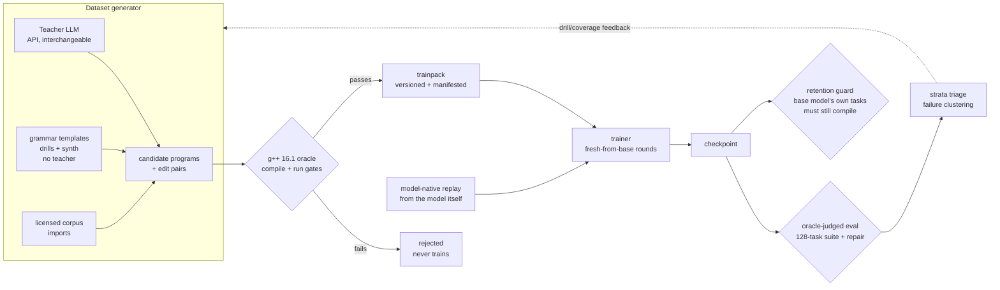
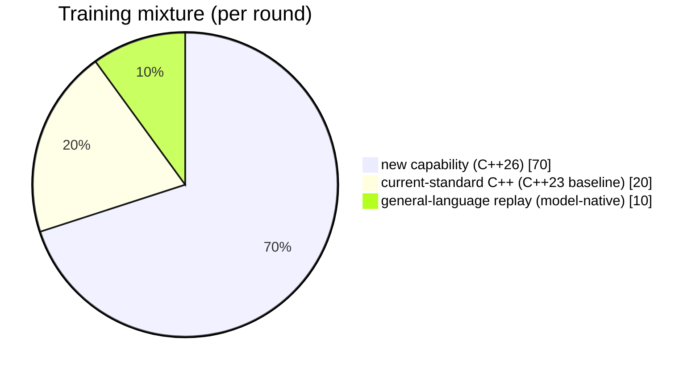
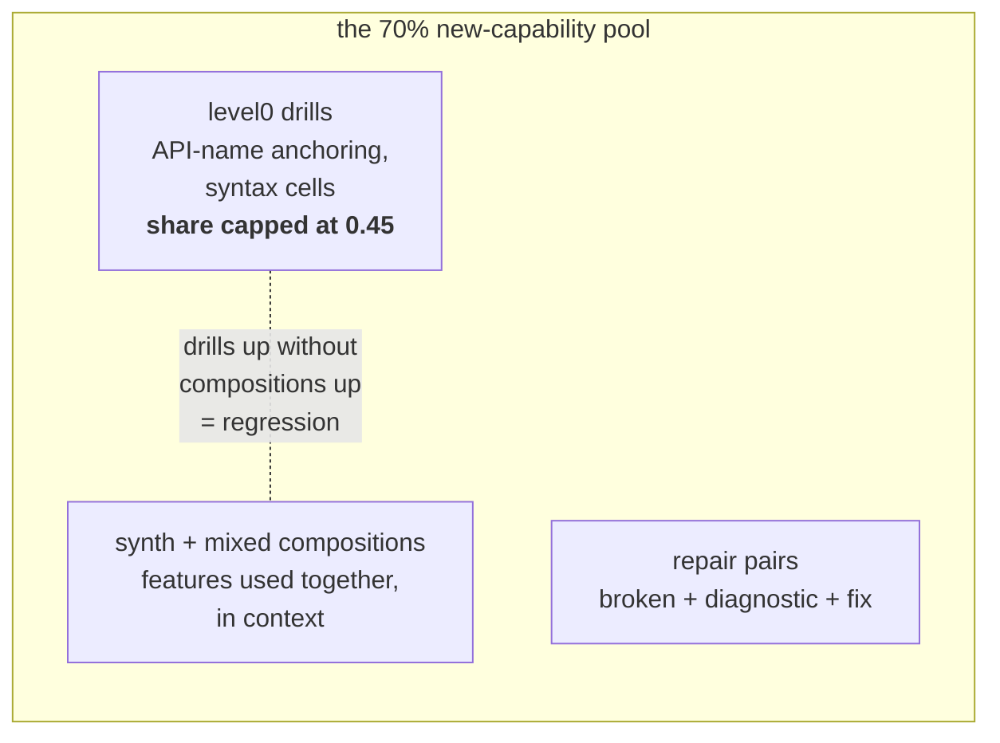
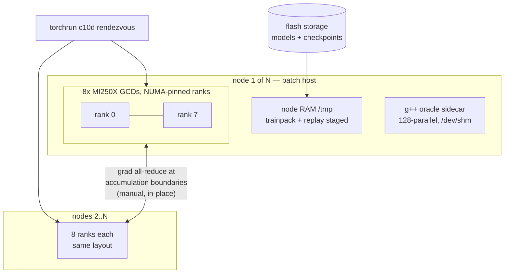
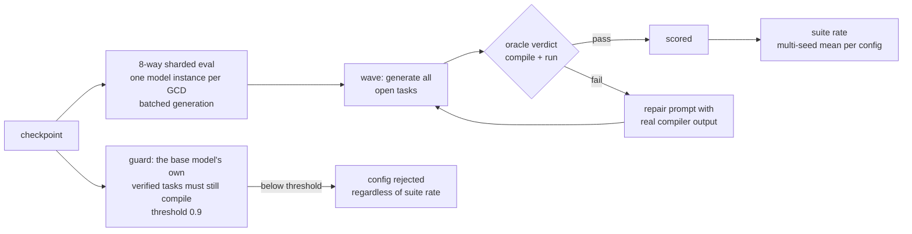

# Training architecture

How a compiler, a teacher model, and a trainer form one verified loop —
and why no unverified token ever reaches the model being trained.

The system trains open-weights models (currently Ministral-3 14B) on
capabilities that did not exist in their pretraining data (C++26
reflection, contracts), using a **compiler as ground truth** at every
stage: corpus admission, checkpoint evaluation, and retention guarding.

## The verified-data flywheel

Three properties make this loop trustworthy:

1. **Verification firewall.** Every training exemplar — teacher-written,
   template-generated, or imported — must compile *and run* before it may
   teach. Teacher quality therefore affects **yield and coverage, never
   correctness**: a weaker teacher produces fewer admitted samples, not
   wronger ones. The same firewall gates evaluation: a checkpoint's score
   is the compiler's verdict on its output, not string similarity.
2. **Model-native replay.** Anchoring data (general chat, ordinary
   modern C++) is generated by **the model being trained** and
   oracle-verified — never by the teacher, never by another model.
   Cross-model replay measurably collapses adjacent knowledge; this rule
   came from a failed run, not caution.
3. **Provenance everywhere.** Data ships only as a versioned trainpack
   (generator commit, per-file sha256, record counts); the harness ships
   as a committed-tree snapshot with its commit stamped; every training
   round records its exact mixture, drill share, seed, and both stamps.
   Any result can be traced to the code and data that produced it.

## The teacher's role, precisely

The teacher is an external LLM reached over an API (currently a DeepSeek
model; the pipeline is teacher-agnostic — any capable model slots in).
It authors two of the corpus streams:

| stream | author | oracle gate | share of corpus |
|---|---|---|---|
| level0 drills | grammar templates | compile+run | high (drill share capped) |
| synth | grammar-driven generator | compile+run | volume engine |
| **gen (feature programs)** | **teacher** | compile+run | targeted coverage |
| **edit pairs (repair)** | **teacher + real compiler errors** | compile+run | repair training |
| imports | licensed external corpora | compile+run | baseline breadth |
| replay anchors | the trained model itself | compile+run | retention |

The teacher never sees the trained model, never judges evaluations, and
its prose never trains — only its *programs* do, and only after they
survive the compiler. Repair pairs are the interesting case: the broken
half comes from real failures with real `g++` diagnostics, the fixed
half must pass the oracle — the teacher supplies the fix, the compiler
decides whether it counts. This is what teaches the model to correct its
own failed generations from compiler output at inference time.

## The mixture: 70/20/10 and the rules inside it

**70% new / 20% baseline / 30% total anchoring.** The 70 teaches the
capability; the 20 keeps ordinary modern C++ competence from eroding
under feature-dense data; the 10 keeps chat style and world knowledge
from drifting toward the domain corpus. The two anchor bands come from
different sources on purpose: the C++23 baseline is generator-produced
and oracle-verified, while the general replay is produced by **the model
being trained** at round setup — never stored as a dataset artifact,
never teacher-written (see the model-native replay rule above).

Inside the 70, a second ratio matters as much as the macro mixture:

**Drill share is capped (0.45)** because it was twice observed that
growing drill volume without growing composition volume *regresses*
composed usage and guard behavior — the model gets better at isolated
syntax and worse at using features together. Pass rates track per-cell
drill coverage, but only when the composition stream grows in step.

Rules that ride along with the mixture, each bought with a failed run:

- **Warmup + linear LR decay to zero.** Constant LR on a small corpus
  mode-collapses: unrelated questions answered with verbatim training
  sentences. The collapse tracks the LR trajectory, not the final loss.
- **Sustained loss ≤ 1e-3 = reject the run** (scripted abort). That deep
  in memorization the model goes repair-deaf and breaks guards; anchor
  data does not rescue it.
- **≥3 seeds per configuration.** Identical recipes vary by σ≈5 points
  on the eval suite; drilled families are seed-robust while
  capacity-limited families are a seed lottery. Single-seed comparisons
  are noise; best-of-N seeds is cheap capability.
- **Fresh-from-base rounds** for attribution — continue-training only
  inside an already-selected lineage.

These knobs — mixture ratios, drill share, seed — are exactly the axes
the population search sweeps: every training round records its values,
and generations move the priors only on multi-seed evidence.

## Training topology (LUMI-G, measured)

The load-bearing decisions, each bought with a measured failure:

- **Manual gradient synchronization, not DDP.** DDP's reducer buckets
  plus engine-materialized gradients peak at 2× gradient memory — a 14B
  model cannot fit that on a 64 GB GCD at any batch size. A plain module
  with an in-place all-reduce at accumulation boundaries costs zero extra
  memory and amortizes communication over the window: **96.5% / 94.4%
  scaling efficiency at 2 / 4 nodes**, per-GCD throughput flat.
- **Everything hot lives in RAM.** Dataset and replay stage to the
  RAM-backed node `/tmp` at job start; model weights are page-cache
  prefetched; outputs write to RAM and sync once at job end. Parallel
  filesystem traffic is a startup cost, not a steady-state one.
- **The oracle rides along.** Each node runs the g++ 16.1 oracle in the
  container (`/dev/shm` workdir, 128-parallel) — evaluation and
  verification never leave the node.
- **Fixed batch shapes.** ROCm re-autotunes GEMMs per shape; ragged
  batches cost 16×. Every sample is packed or padded to one
  `(batch, seq)` shape.

Measured envelope (MI250X, bf16, gradient checkpointing, Adafactor):
**60.4% MFU** at batch 8 + flash-attention-2, 1,037 steady tok/s per
GCD, 56.5/64 GiB peak — see [lumi-numbers.md](lumi-numbers.md).

## Evaluation and selection

Selection rules, inherited from the small-scale campaign that preceded
LUMI: at least **3 seeds per configuration** (identical recipes vary by
σ≈5 points — single-seed comparisons are meaningless); the retention
guard is a **hard filter**, not a weighted term; failure strata on
losing configurations are clustered and fed back to the generator as
drill and coverage targets for the next generation — failures are
layered, and each generation peels one layer.
