# `sc` — the campaign CLI (usage reference)

`sc` is a **front end to Slurm**: it owns no runtime of its own — one
command turns an intent ("run this generation", "judge every
checkpoint", "train 1B tokens as a segment chain") into the right
Slurm job chain, and all causality lives in Slurm dependencies.
**Closed source, open usage**: the implementation is private; this page
documents the command surface, one flowchart per verb.

Design rules that hold everywhere: everything submitted is a plain
Slurm job — chains via `afterok`, failure janitors via `afternotok`,
**no daemons, no cron**. Errors pause the line; hardware faults
self-heal; nothing burns to a time cap. Every submit verb is
**idempotent** — re-running the same command resumes or converges
instead of duplicating. The jobs execute the open-source harness tools
in this repo ([tools.md](tools.md)).

Every submit verb passes the same gate first:

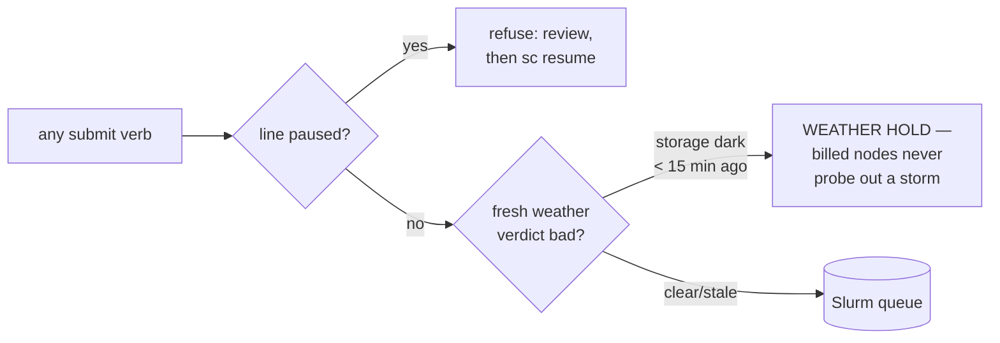

## Launching training

### `sc preflight`

Zero-cost readiness check. Verifies the staged code and data on the login node before anything is allowed to queue — a failed preflight blocks every launch verb.

**Cost:** none (login-side). **Touches:** nothing — read-only verification.

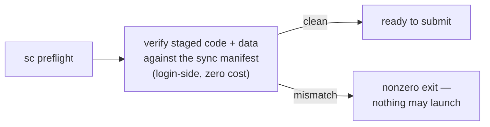

### `sc gen MANIFEST`

Launches a whole generation from a manifest file: one training round per row, each with its failure janitor and a chained wide eval, so the verdicts arrive while later rounds are still training.

**Cost:** one training round per manifest row (nodes × steps as specified) + one wide-eval node (~10 min) per row; janitors are ~free CPU jobs. **Touches:** runs/GEN/*, logs.

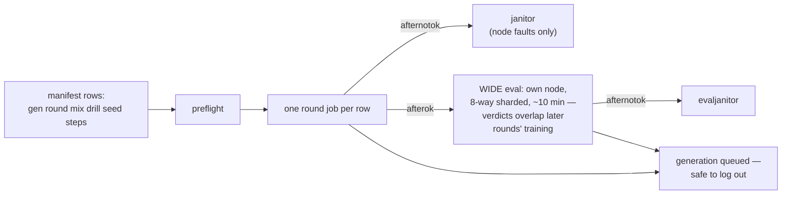

### `sc rounds GEN ROUND MIX DRILL STEPS SEED…`

Launches one recipe across a list of seeds — the seed-replication form of `gen` (≥3 seeds per config; single-seed comparisons are noise).

**Cost:** one round + one eval per seed. **Touches:** runs/GEN/ROUND-sSEED.

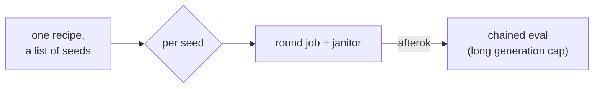

### `sc consolidate NAME MIX DRILL SEED [MTOK]`

Trains a large token budget as an idempotent chain of Slurm segments
sharing one LR schedule, widening across a node ladder, with concurrent
per-segment evals and automatic plateau cutoff. Re-running the same
command is the recovery procedure — completed segments are detected on
disk and skipped, so a re-run only ever spends the *remaining* token
budget, and the plateau cutoff can shrink even that.

**Cost:** bounded by the UNSPENT part of MTOK (done segments skip; plateau cutoff cancels the pending tail) + one eval node per segment + one spare node per segment. **Touches:** runs/consol/NAME/seg*.

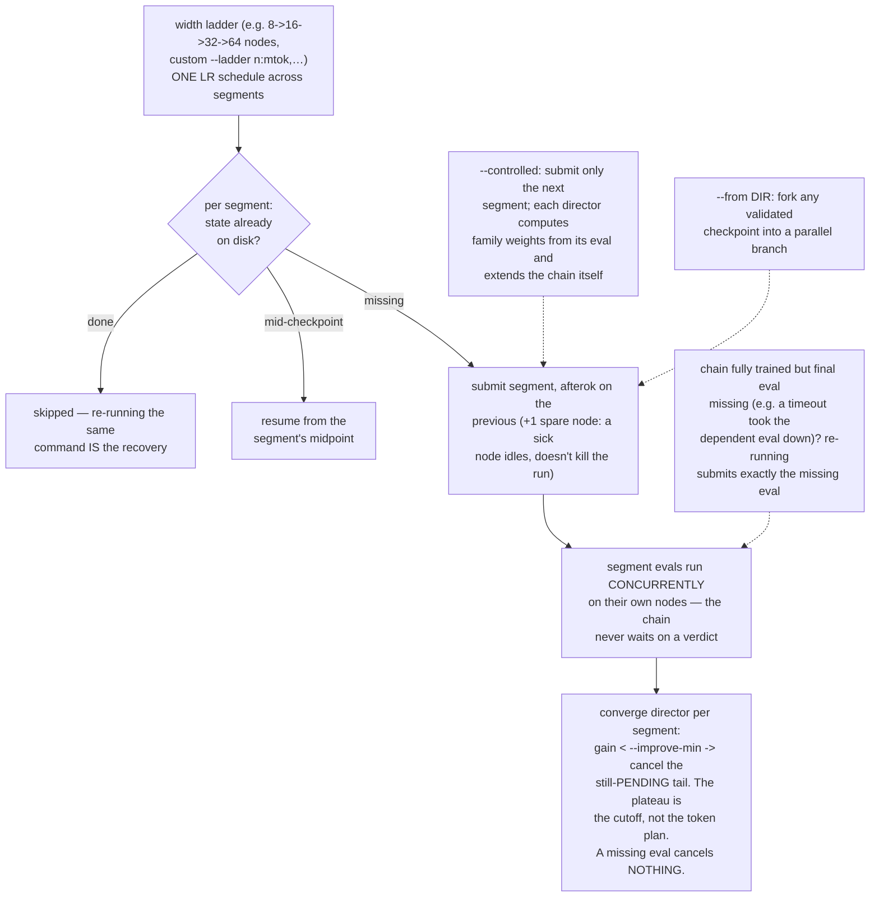

### `sc campaign PLAN.json [--continue|--reset]`

Runs an unattended multi-stage arc from a JSON plan: each stage's terminal jobs chain a director job that gates on artifacts and submits the next stage. A failed gate pauses the line with the reason.

**Cost:** the sum of its stages, one stage at a time; directors are ~free 10-min CPU jobs. **Touches:** campaign state/log + whatever each stage touches.

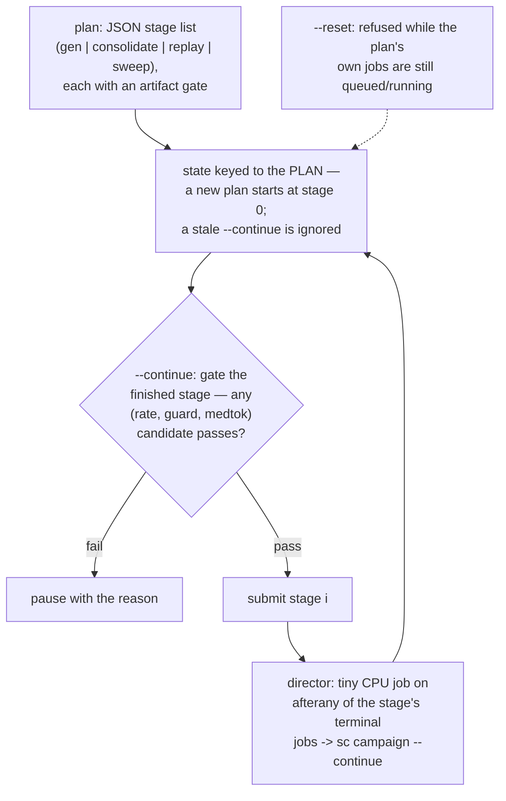

### `sc reconcile [--plan P]`

Converges reality toward the plan: observes what exists (run tree,
queue) versus what should, and submits **exactly what is missing —
never what already exists**. The recovery verb for PLAN-FILE campaigns
— it reads the campaign state, so it will faithfully chase whatever
plan that state names. A consolidate launched directly (no plan file)
recovers by re-running its own command, which is equally idempotent;
retire stale campaign state first or reconcile will resurrect the old
plan. Reconcile itself is free (login-side,
read-only); any GPU cost you see afterwards is the *unfinished
remainder of the original plan* resuming, not work being redone.

**Cost:** free in itself (login-side, read-only); anything it submits is the plan's missing remainder only. **Touches:** nothing directly — it only submits jobs.

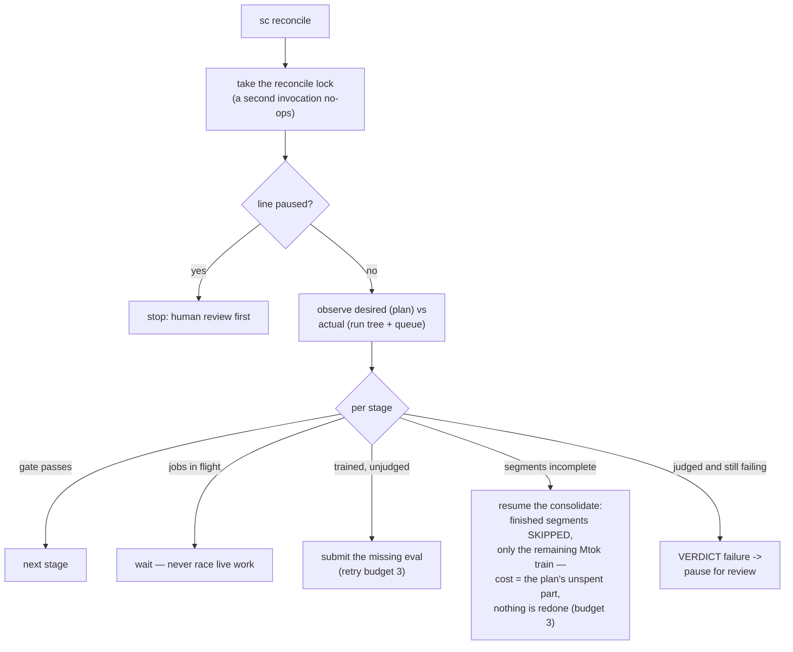

The recovery verb: level-triggered convergence, safe to invoke at any
moment from any trigger. It replaced the resume/reset/continue decision
tree — decisions come from observed state, never from which event
fired. Infra gaps get a bounded retry budget; real verdicts get a
human.

## Judging

### `sc eval RUNDIR…`

Judges specific checkpoints: one wide (8-way sharded) eval job per run dir, each with its own janitor.

**Cost:** one node × ~10 min per checkpoint. **Touches:** RUNDIR/eval/.

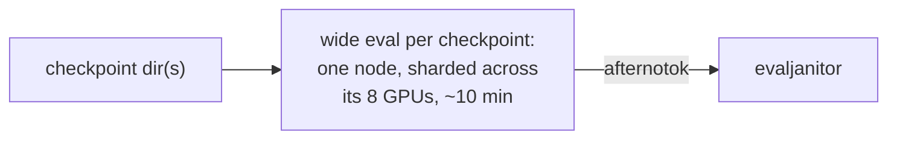

### `sc sweep [--dense]`

Finds every checkpoint that has a model but no verdict and judges them all — wide by default, packed 8-per-node with `--dense`.

**Cost:** one node × ~10 min per gap (wide); --dense packs 8 checkpoints per node — same GPU-h, longer wall. **Touches:** each gap's eval/.

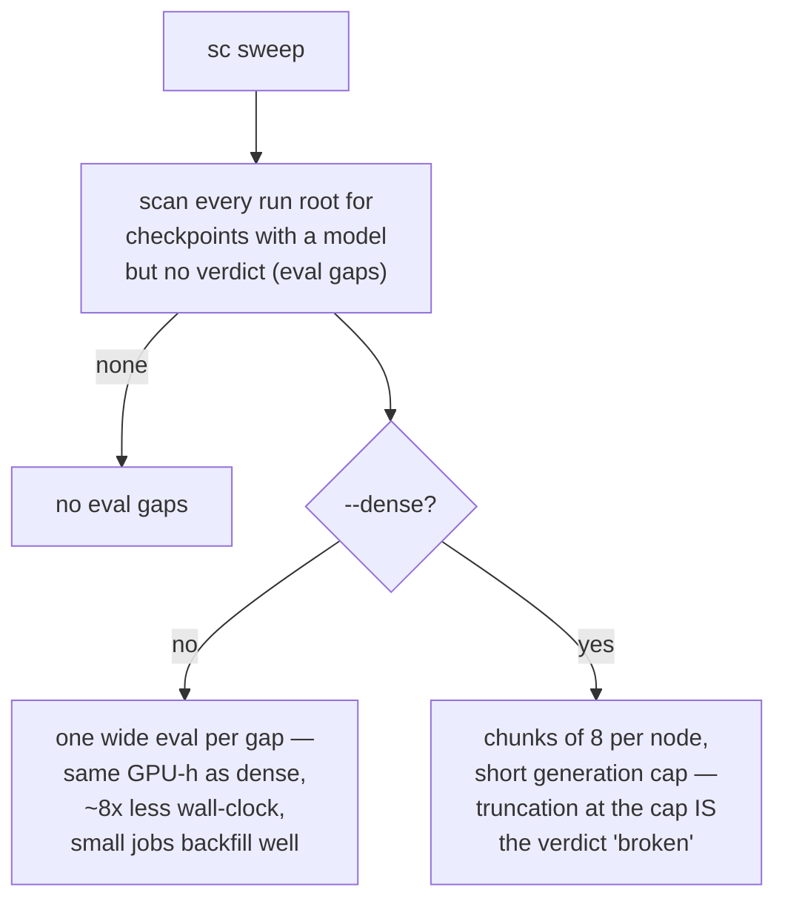

### `sc bench TAG --model M --suite S`

Evaluates any model directory against any suite through the standard judge — for baselining foreign models or re-scoring ours on new suites.

**Cost:** one wide-eval node-run. **Touches:** runs/bench/TAG only.

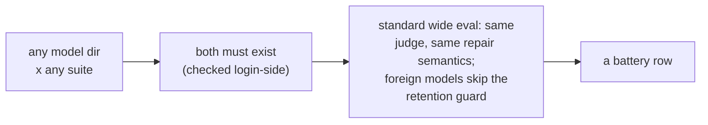

## Data

### `sc replay [COUNT]`

Regenerates the retention band at scale: the base model answers plain-C++ prompts, the compiler keeps verified pairs. The anchor data that stops fine-tuning from eroding ordinary competence.

**Cost:** one single-node generation job (scales with COUNT). **Touches:** the replay band artifact.

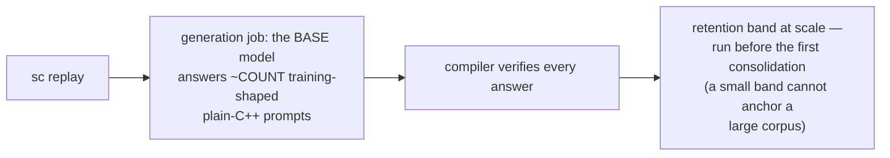

### `sc harvest TAG [--nodes N --samples K --temp T]`

Expert-iteration burst: the model samples best-of-K answers to fresh prompts across N independent single-node jobs; oracle-verified winners become the next trainpack's expert band.

**Cost:** N single-node jobs for the sampling wall-clock; re-runs pay only unfinished shards. **Touches:** runs/harvest/TAG.

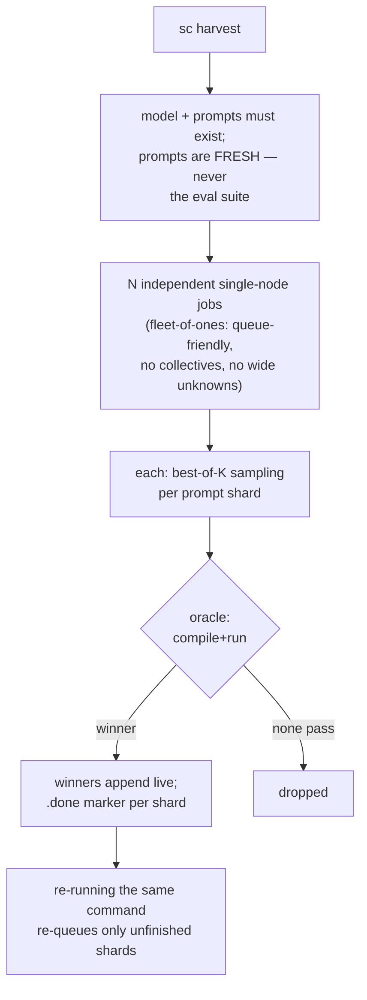

### `sc corpusfetch`

Prefetches every registry package to shared storage from the login node, because compute nodes have no internet.

**Cost:** login-node bandwidth only. **Touches:** the corpus source staging dir.

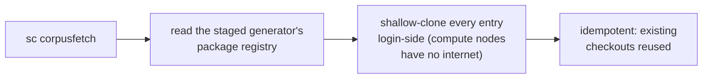

### `sc corpus`

Submits the corpus-factory job that harvests the prefetched packages into verified training records — after checking every precondition login-side.

**Cost:** one CPU-partition job (no GPUs). **Touches:** the corpus output file, append-only.

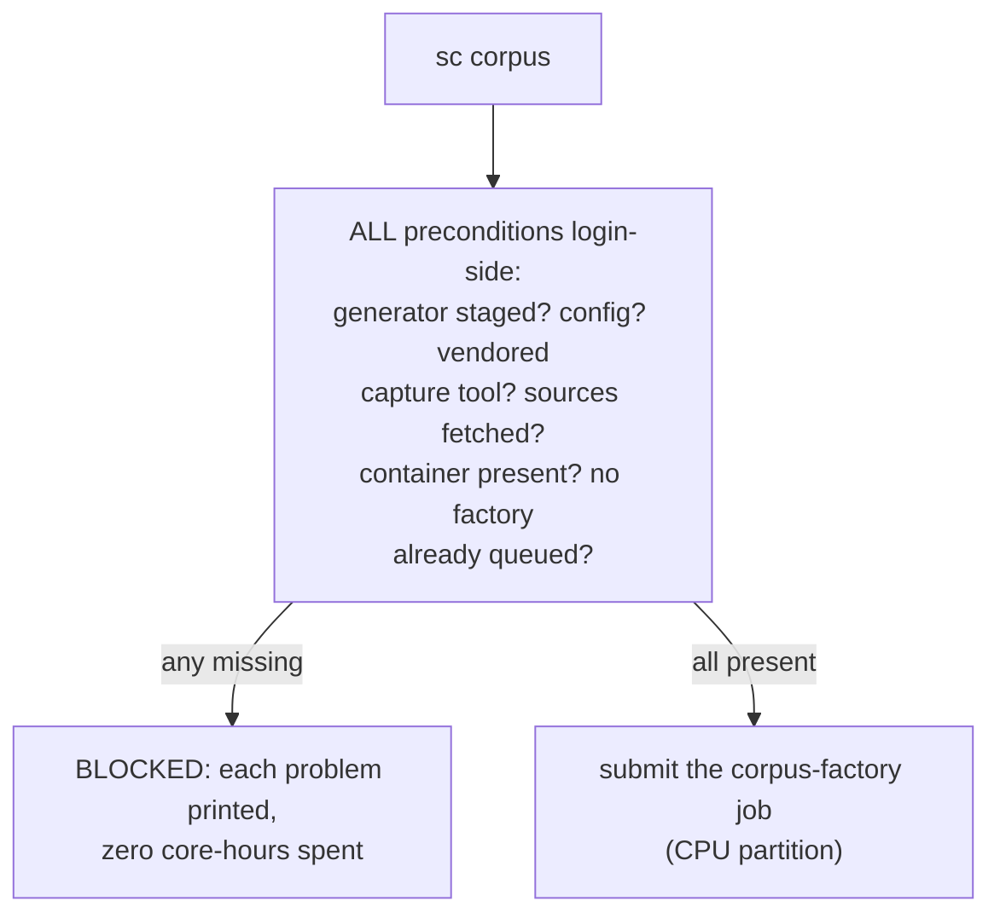

### `sc keep GEN/ROUND-sSEED…`

Re-derives a lost keeper checkpoint by retraining its recorded recipe. The result is a new sample of that recipe, judged by its own fresh eval.

**Cost:** one full round retrain + eval per keeper — the most expensive recovery verb; use only for checkpoints worth that price. **Touches:** the run dir + retention tier on success.

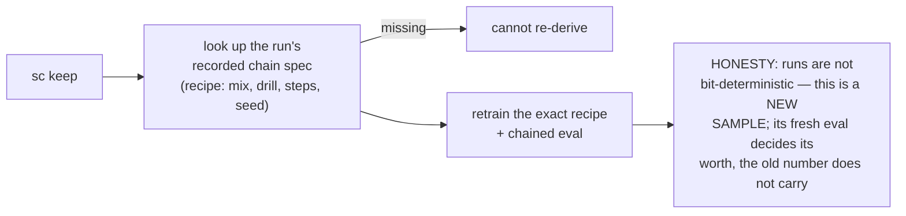

## Observing (read-only)

All observation verbs are free: login-side reads of the queue, the
run tree, and accounting — no jobs, no writes.

### `sc status`

The one-look campaign dashboard: rates, burn, failures, gaps, and what is running — ordered so the most important line lands next to the prompt.

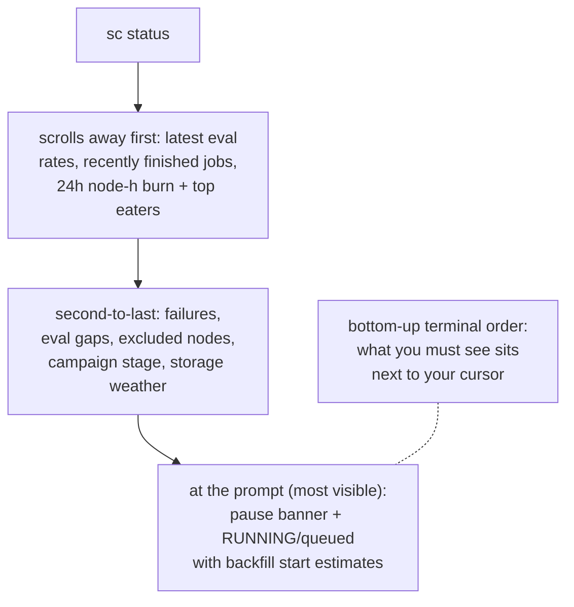

### `sc status-all` · `sc health` · `sc jobstate JOBID`

Drill-downs: `status-all` adds a process-level look inside every running job, `health` probes running jobs for hangs, `jobstate` inspects one job.

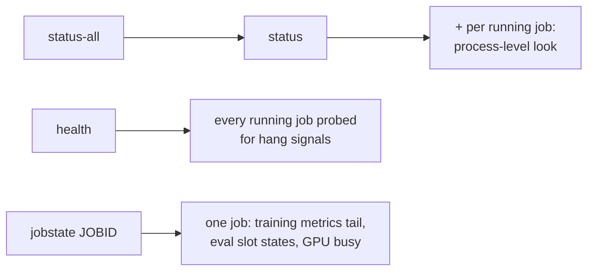

### `sc report GEN [REF] [PREV]`

Prints the decision contract for a generation — the numbers a go/no-go is actually made on, with reference and previous-generation columns.

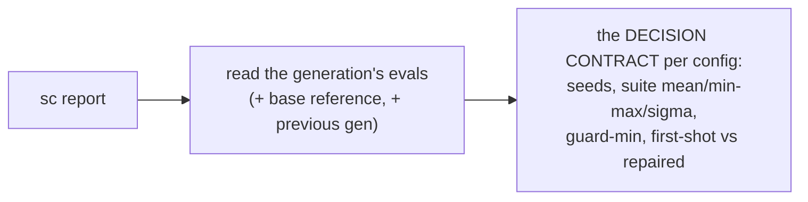

### `sc quota`

Everything spendable in one read-only view: billing units, storage on both tiers, node ceilings, idle capacity, and start estimates for burst shapes.

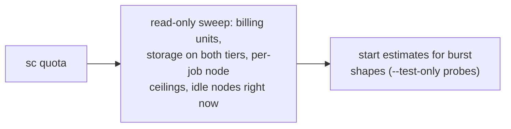

### `sc weatherprobe` · `sc weather`

Storage-weather instrumentation: `weatherprobe` is the scheduled background probe that writes the verdict submissions consult; `weather` mines our own job logs into an hour-of-day stall grid.

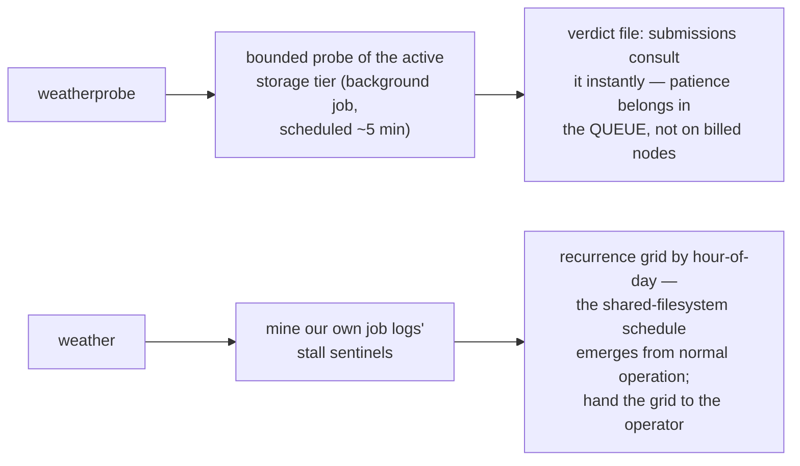

### `sc watch` · `sc bg VERB…`

`watch` is a finite collect-everything loop (drain, sweep, drain, report); `bg` detaches any verb so it survives logout.

```mermaid
flowchart LR
    W2["sc bg watch GEN"] --> DT["re-exec detached<br/>(survives logout)"]
    DT --> LOOP2["finite loop: drain queue -><br/>sweep gaps -> drain -> report"]
```

## Recovery

Janitors and resume are ~free (CPU-minutes and a file write); the only
expensive recovery is `keep`, priced above.

### `sc janitor` · `sc evaljanitor NAME`

The two automatic responders: `janitor` recovers node-fault failures (the only auto-retry class), `evaljanitor` retries a failed eval exactly once before pausing the line.

```mermaid
flowchart TB
    F{failed job} -- "node fault<br/>(the ONLY auto-retry)" --> JN2["janitor: resubmit the chain,<br/>add the node to the exclude list,<br/>REPORT it upstream — not<br/>just route around"]
    F -- "anything else" --> P2["pause the line: queued jobs<br/>no-op, submissions refuse —<br/>errors are information"]
    EVF{failed eval} --> EJ3["evaljanitor: verdict already<br/>on disk? done. else retry ONCE<br/>(shard-resume reuses finished<br/>work); second failure -> pause"]
```

### `sc resume`

Clears the pause after human review and lists what still needs judging.

```mermaid
flowchart LR
    RS2[sc resume] --> CL2["clear the pause<br/>(after human review)"]
    CL2 --> GAPS["list checkpoints still<br/>unjudged -> sc sweep"]
```

## Storage doctrine

All storage verbs are free of compute — filesystem moves, symlinks,
and deletes; `gc` is dry-run by default and never touches evidence.

### `sc clean` · `sc archive` · `sc gc [--delete]`

Storage-doctrine enforcement: `clean` retires judged checkpoints and folds strays home, `archive` pushes superseded artifacts to the retention tier, `gc` reclaims weight space while always keeping the scientific record.

```mermaid
flowchart TB
    CLN[sc clean] --> DOC["doctrine: working tier = records +<br/>in-flight checkpoints; retention<br/>tier = evaluated ones"]
    DOC --> RET["retire evaluated checkpoints<br/>(symlink left behind)"]
    DOC --> SAL["delete weight-bearing salvage"]
    DOC --> FOLD["fold stray scratch trees home"]
    AR[sc archive] --> SUP["superseded artifacts only:<br/>sealed segments' predecessors,<br/>judged round checkpoints"]
    SUP --> MV["push to retention, symlink back,<br/>idempotent — nothing hot touched"]
    GC[sc gc] --> SCAN2["scan every run's weights;<br/>KEEP: release, current best,<br/>anything touched < 24h"]
    SCAN2 --> DRY["dry-run report: reclaimable GiB"]
    DRY -- "--delete" --> DEL["remove weights of superseded runs;<br/>the scientific record (evals, metrics,<br/>manifests, validations) is ALWAYS kept"]
```

---

Inside the jobs: the open-source harness tools in this repo —
flowcharts in [tools.md](tools.md). Dataset-side commands (`cpp26ds`:
drillgen, synthgen, harvest-packages, trainpack, …):
[storax-dataset-cpp26 docs/cli.md](https://github.com/storax-io/storax-dataset-cpp26/blob/main/docs/cli.md).
