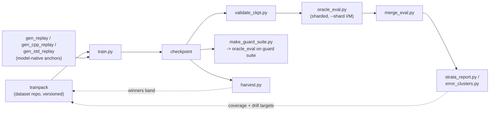
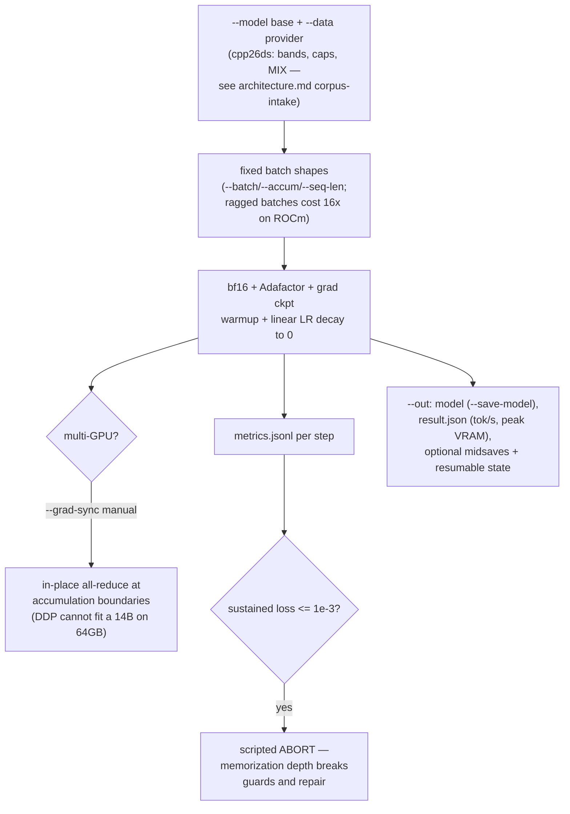
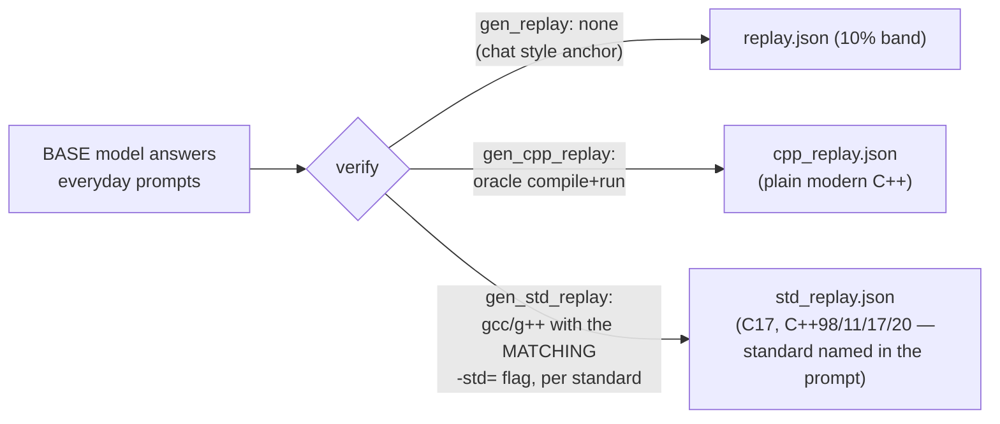
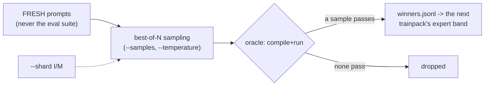
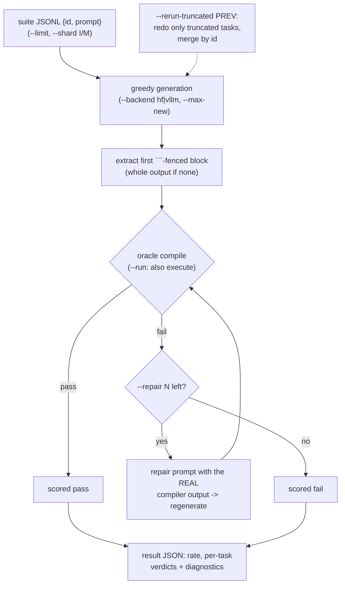
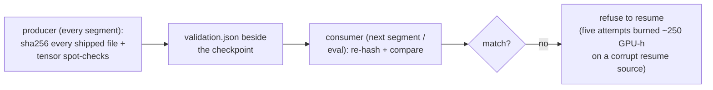
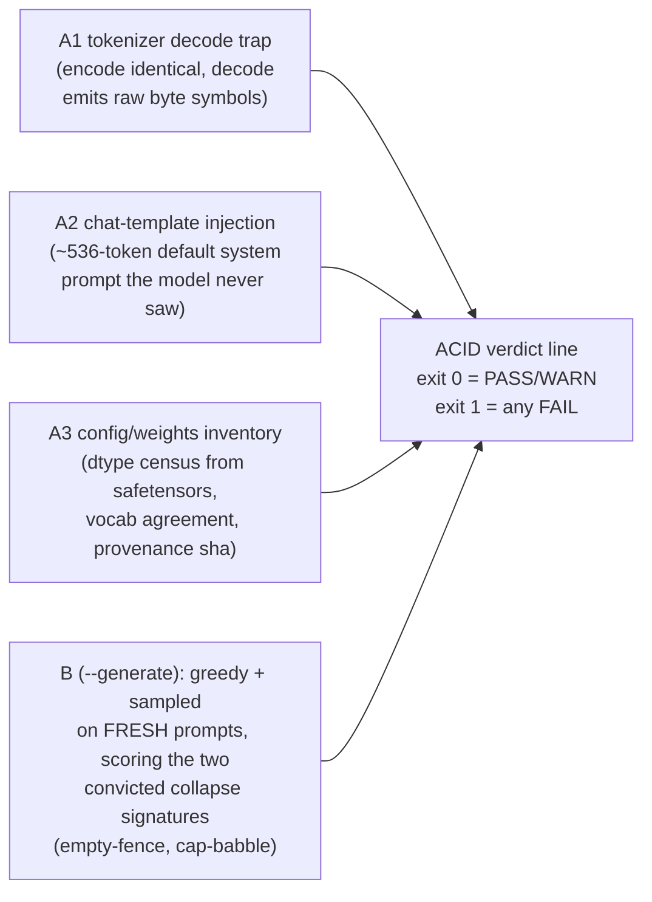
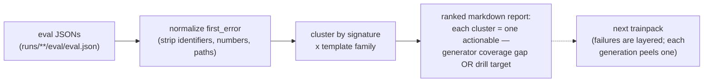

# Harness CLI reference — every command as a flowchart

The harness is a set of standalone entry points, not a monolith:
`traintest/*.py` are the training-loop verbs, `tools/*.py` the
triage/ops verbs. On WSL/Linux everything runs through the venv wrapper
— `scripts/run_linux.sh <script.py> [args…]` — and on LUMI through the
container equivalents; the scripts themselves are identical everywhere.

How the verbs compose into one round of the storax loop:

## Training

### `train.py --data cpp26ds --out DIR` — one round

Key flags: `--total-steps` (LR schedule truth for multi-segment runs),
`--resume-state/--save-state`, `--freeze`, `--seed` (≥3 seeds per
config — single-seed comparisons are noise), `--min-free-vram` (refuses
to start on a busy card).

### Replay generators — the model-native anchors

All three share one shape; they differ in what they anchor and how the
answer is verified. **Model-native replay only** — the anchors come
from the base model being trained, never from a teacher.

### `harvest.py --model DIR --prompts P.jsonl --samples 8` — expert iteration

The model teaches itself whatever it can already sample but not yet
rank first; the compiler keeps the winners.

## Evaluation

### `oracle_eval.py --model M --suite S.jsonl --out R.json` — the verdict layer

Runs wide by default on LUMI: one shard per GCD, `merge_eval.py`
recombines — the eval SLO is ~10–15 min wall, never an hour.

### `merge_eval.py merged.json shard*.json`

Recomputes rates over deduped per-task results (later files win,
matching oracle_eval's own rerun-merge semantics).

### `evaluate.py` / `chat.py` / `chatprobe.py`

Phase-0 facts QA (string-keyed, pre-oracle era), interactive REPL
probing, and scripted chat probes respectively — de-risking tools, not
part of the verdict layer.

## Gates and triage

### `validate_ckpt.py` — trust no artifact you didn't verify

### `model_acid.py MODEL_DIR [--generate]` — before trusting any checkpoint on any host

Self-contained on purpose (stdlib + transformers): suite hosts don't
carry the harness, and these traps live exactly in tools outside it.

### `make_guard_suite.py` — the retention guard

Builds a compiler-verified suite from `cpp_replay.json` — tasks the
base model provably answered correctly. A checkpoint that stops
compiling on them has eroded plain-C++ competence; the guard is a
**hard filter** at threshold 0.9, regardless of suite rate.

### `strata_report.py` / `error_clusters.py` — failures into generator work

## Ops

| tool | one line |
|---|---|
| `scripts/run_linux.sh` | run any traintest script under the WSL ROCm venv (closest local twin of the LUMI container) |
| `tools/estimate.py` | project measured MFU to other GPUs/model sizes |
| `tools/gpu_acceptance.py` / `node_probe.py` | is this card/node healthy enough to train on |
| `tools/cpp26_loop.py` | local dynamic rounds: train → probe-eval → add oracle-verified remedials for failing error classes → retrain |
| `tools/learning_curve.py` / `gen_report.py` | plots and run reports from metrics.jsonl |
| `tools/model_acid.py` | see above — ships to any host, no harness needed |

Dataset-side commands (`cpp26ds …`: drillgen, synthgen, harvest-packages,
trainpack, …) live in the dataset repo — flowcharts in
[storax-dataset-cpp26 docs/cli.md](../../storax-dataset-cpp26/docs/cli.md).
