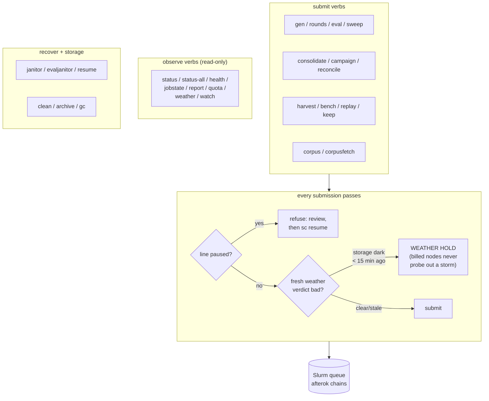
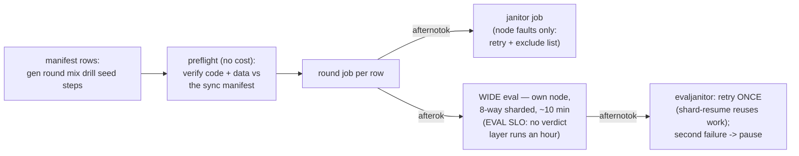
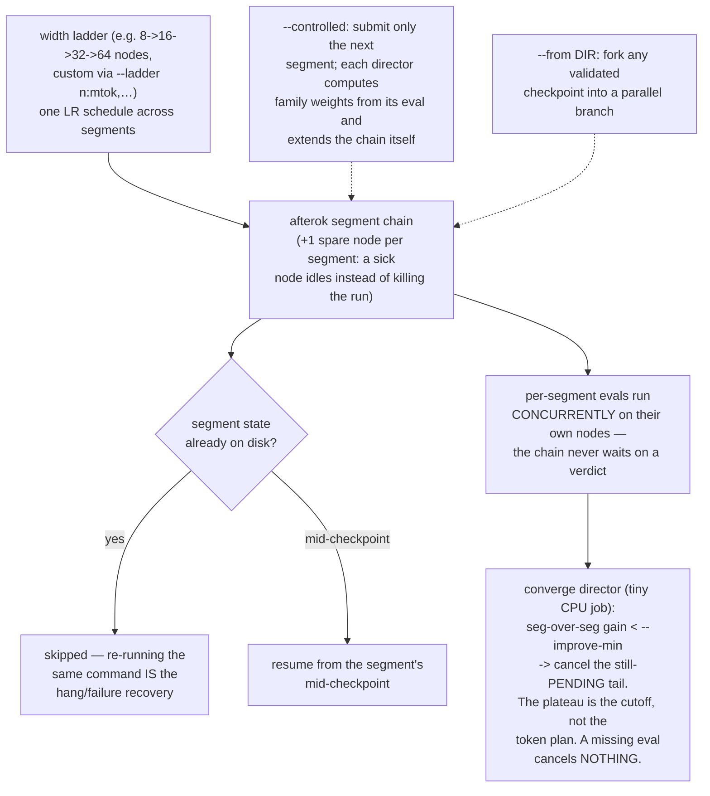
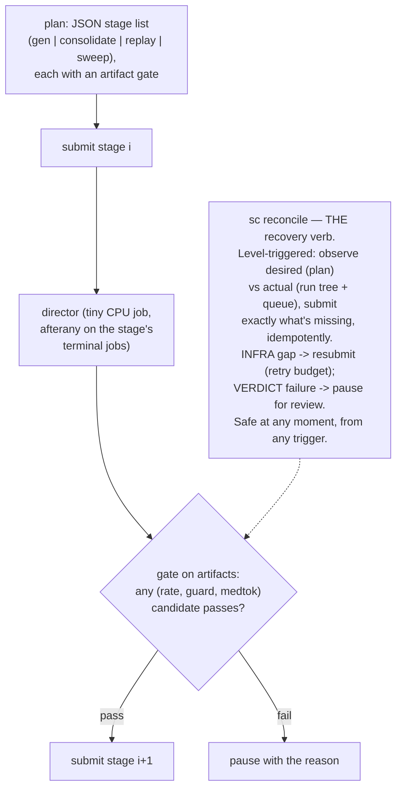
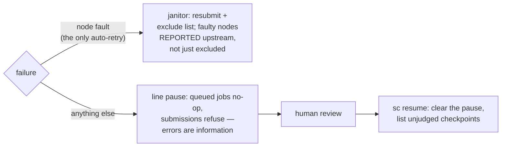

# `sc` — the campaign CLI (usage reference)

`sc` is how the storax training campaign is operated on the
supercomputer: one command turns an intent — "run this generation",
"judge every checkpoint", "train 1B tokens as a segment chain" — into
a Slurm job chain. **Closed source, open usage**: the implementation is
private; this page documents the command surface and its semantics.

Design rules that hold for every verb: everything submitted is a plain
Slurm job — chains via `afterok`, failure janitors via `afternotok`,
**no daemons, no cron**. Errors pause the line; hardware faults
self-heal; nothing burns to a time cap. Every submit verb is
**idempotent** — re-running the same command resumes or converges
instead of duplicating work. The jobs themselves execute the
open-source harness tools in this repo ([tools.md](tools.md)).

## Launching training

### `sc preflight` · `sc gen MANIFEST` · `sc rounds GEN ROUND MIX DRILL STEPS SEED…`

`gen` reads a manifest (one row per round: generation, round name, mix,
drill share, seed, steps) and queues the whole generation — rounds,
per-round wide evals, janitors — then it is safe to log out. `rounds`
is the single-recipe form for a list of seeds.

### `sc consolidate NAME MIX DRILL SEED [MTOK]` — segment-chain training

### `sc campaign PLAN.json` · `sc reconcile` — unattended multi-stage arcs

Campaign state is keyed to the plan (a new plan starts at stage 0); a
stale director continuation is ignored. `reconcile` replaced the whole
resume/reset/continue decision tree: decisions come from observed
state, never from which event fired.

## Judging

### `sc eval RUNDIR…` · `sc sweep [--dense]` · `sc bench TAG --model M --suite S`

| verb | semantics |
|---|---|
| `eval` | wide eval per checkpoint: one node, sharded across its 8 GPUs, ~10 min — same GPU-h as dense, ~8× less wall-clock, small jobs backfill well |
| `sweep` | find every checkpoint with a model but no verdict and submit wide evals for all of them; `--dense` packs 8 per node with a short generation cap — a truncation at the cap *is* the verdict "broken" |
| `bench` | any model × any suite through the same judge with the same repair semantics; foreign models skip the retention guard |

## Data verbs

| verb | semantics |
|---|---|
| `sc replay [COUNT]` | regenerate the retention band at scale: base-model answers to training-shaped plain-C++ prompts, compiler-verified — run before the first consolidation |
| `sc harvest TAG` | expert-iteration burst: N independent single-node jobs, best-of-N sampling on FRESH prompts (never the eval suite), the oracle keeps verified winners; fleet-of-ones queues well; re-run to resume unfinished shards |
| `sc corpusfetch` | login-side prefetch (compute nodes have no internet): shallow-clone every registry package for the corpus factory |
| `sc corpus` | submit the corpus-factory job — **all** preconditions checked login-side before a single core-hour is queued |

## Observing

| verb | one line |
|---|---|
| `sc status` | bottom-up terminal order: latest rates and 24h burn scroll away, failures sit second-to-last, RUNNING lands at the prompt; plus eval gaps, excluded nodes, campaign stage, storage weather |
| `sc status-all` | status + a process-level look inside every running job |
| `sc health` | probe running jobs for hangs |
| `sc jobstate JOBID` | peek inside one job: metrics tail, eval slot states, GPU busy |
| `sc report GEN [REF] [PREV]` | the generation decision contract: seeds, suite mean/min–max/σ, guard-min, first-shot vs repaired |
| `sc quota` | billing units, storage on both tiers, node ceilings, idle counts, start estimates for burst shapes — read-only |
| `sc weatherprobe` | background storage-weather probe (scheduled ~5 min); submissions consult the stored verdict instead of discovering the weather on a paid allocation |
| `sc weather` | stall-recurrence grid by hour-of-day, mined from our own job telemetry — the shared-filesystem schedule emerges from normal operation |
| `sc watch` | finite collection loop: drain → sweep gaps → drain → report; run detached via `sc bg watch …` |
| `sc bg VERB…` | re-exec any verb detached (survives logout) |

## Recovery and storage

| verb | semantics |
|---|---|
| `sc clean` | enforce the storage doctrine: working tier holds records + in-flight checkpoints, retention tier holds evaluated ones — retire (symlink back), delete salvage debris, fold strays home |
| `sc archive` | push superseded artifacts to the retention tier (sealed segments' predecessors, judged round checkpoints); symlinks left; idempotent |
| `sc gc [--delete]` | weights of superseded runs are disposable; the scientific record (evals, metrics, manifests, validations) is always kept; dry-run by default |
| `sc keep GEN/ROUND-sSEED…` | re-derive lost keeper checkpoints from their chain specs — honestly: runs are not bit-deterministic, a re-derived keeper is a NEW SAMPLE and its fresh eval decides its worth |

---

Inside the jobs: the open-source harness tools in this repo —
flowcharts in [tools.md](tools.md). Dataset-side commands (`cpp26ds`:
drillgen, synthgen, harvest-packages, trainpack, …):
[storax-dataset-cpp26 docs/cli.md](https://github.com/storax-io/storax-dataset-cpp26/blob/main/docs/cli.md).
