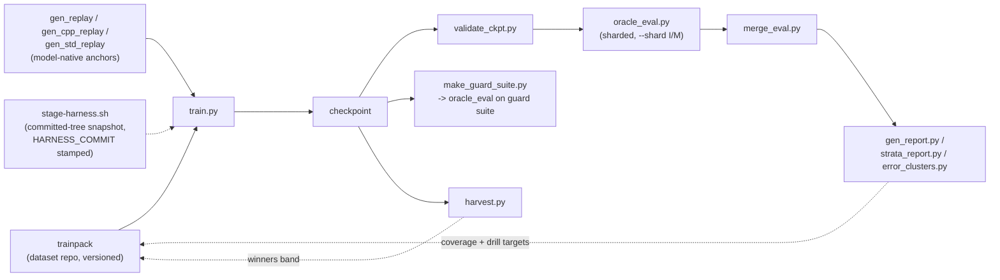
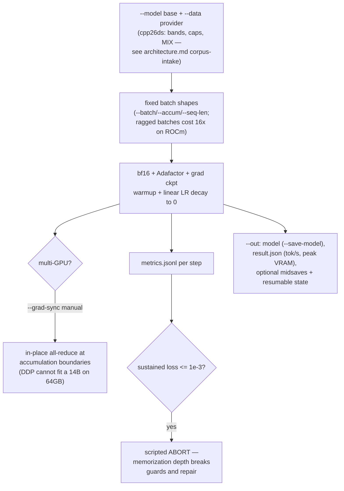
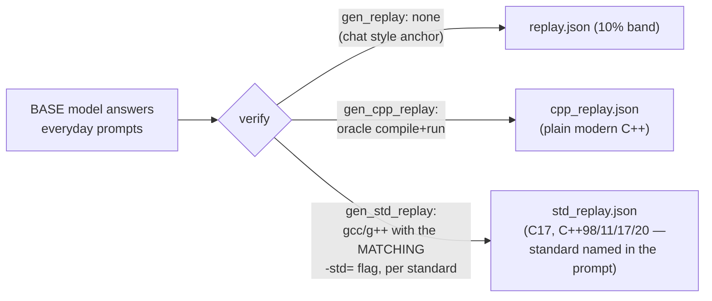
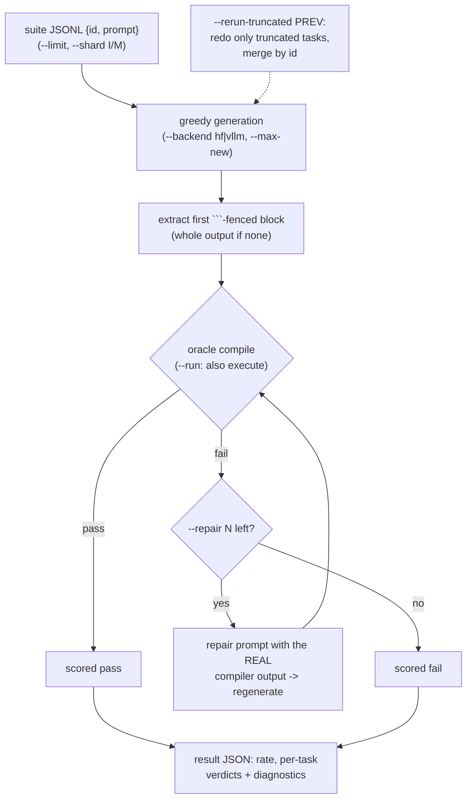
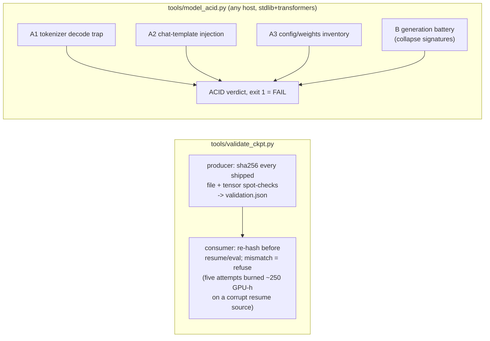
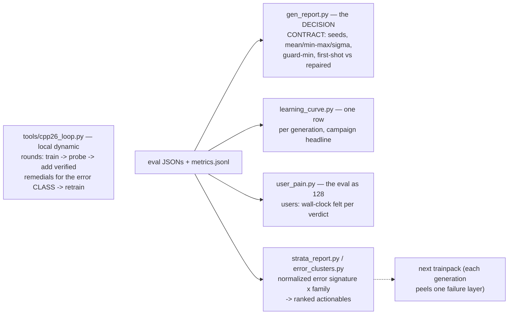
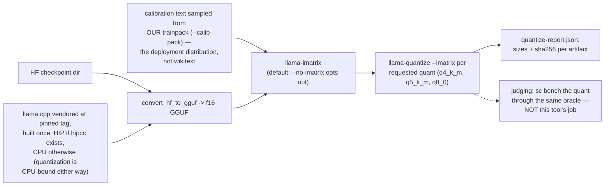

# Harness tools — every script as a flowchart

The harness is a set of standalone entry points, not a monolith:
`traintest/*.py` are the training-loop verbs, `tools/*.py` the
gate/triage/ops verbs, `scripts/*.sh` the runners. On LUMI these are
orchestrated by the `sc` campaign CLI ([usage reference](cli.md);
closed source) as plain Slurm jobs. This page documents the tools
themselves — they run identically under the local runners and inside
the container.

How the tools compose into one round of the storax loop:

Local runners: `scripts/run_linux.sh <script.py>` (WSL ROCm venv — the
local twin of the LUMI container), `scripts/run_win.sh` (Windows venv,
syncs to C: staging first), `scripts/stage-harness.sh` (committed-tree
snapshot via `git archive`, HARNESS_COMMIT stamped — a dirty tree
cannot leak).

### `train.py --data cpp26ds --out DIR` — one round

Key flags: `--total-steps` (LR schedule truth for multi-segment runs),
`--resume-state/--save-state`, `--freeze`, `--seed` (≥3 seeds per
config), `--min-free-vram` (refuses a busy card). **Data providers**
(`--data` plugins, not commands): `cpp26dsdata.py` (bands/caps/MIX),
`cpp26data.py` (earlier corpus provider), `facts.py` (phase-0);
`hfcompat.py` is the transformers 4/5 chat-template shim under all of
them.

### Replay generators — the model-native anchors

**Model-native replay only** — anchors come from the model being
trained, never a teacher. On LUMI the first of these runs at scale as the retention-band job.

### `oracle_eval.py --model M --suite S.jsonl` — the verdict layer

`merge_eval.py merged.json shard*.json` recombines shards (later files
win, matching oracle_eval's own rerun-merge semantics). This is the judge behind every sharded eval on LUMI.

### `harvest.py` — expert iteration

Best-of-N sampling on fresh prompts; the oracle keeps winners →
`winners.jsonl` → the next trainpack's expert band. The model teaches
itself whatever it can already sample but not yet rank first.

### Gates

`tools/make_guard_suite.py` builds the retention-guard suite from
`cpp_replay.json` — tasks the base model provably answered; the guard
is a **hard filter** at 0.9 regardless of suite rate.

### Reports and triage

### `tools/quantize.py` — checkpoint to serving artifacts

Quantize-only by design: a quant is judged by the eval battery, never
by its maker.

**Cost:** CPU-minutes (convert + requantize; ~10–20 min for a 14B).
**Touches:** the --out dir + vendored tools/llama.cpp (pinned tag).

### Probes and environment (run before anything expensive)

| tool | one line |
|---|---|
| `traintest/env_probe.py` | ROCm/PyTorch env probe, one JSON, never raises — failures are diagnoses |
| `traintest/triton_probe.py` | compile+run real Triton kernels, numerics vs eager — the Instinct-pathfinding test |
| `traintest/impcheck.py` | surface the real exception behind transformers' lazy-import wrapper |
| `traintest/download.py` | pre-fetch a model into the HF cache |
| `traintest/chat.py` | interactive GPU REPL (`/think`, `/temp`, `/clear`) |
| `traintest/chatprobe.py` | scripted chat probes: general-chat drift, base vs tuned |
| `traintest/thinkprobe.py` | thinking-mode template mechanics + natural trace length |
| `tools/gpu_acceptance.py` | GPU acceptance: VRAM pattern-fill integrity + sustained bf16 burst |
| `tools/node_probe.py` | per-node health: alloc+GEMM+sync every GCD + filesystem touch — a wedged GPU fails in seconds, not mid-round |
| `tools/estimate.py` | project measured MFU to other GPUs/model sizes |
| `tools/quantize.py` | checkpoint -> GGUF quants for serving (llama.cpp vendored+pinned, HIP when hipcc exists, else CPU); sizes+sha256 report; judging a quant stays with the eval battery |

### Phase-0 lineage (kept for the de-risking story)

`evaluate.py` (string-keyed facts QA), `tools/build_dataset.py`
(Wikipedia → facts corpus), `tools/build_cpp26_corpus.py` (first
oracle-verified C++26 corpus builder; superseded by the dataset repo).

---

Dataset-side commands (`cpp26ds …`: drillgen, synthgen,
harvest-packages, trainpack, …) live in the dataset repo — flowcharts
in [storax-dataset-cpp26 docs/cli.md](https://github.com/storax-io/storax-dataset-cpp26/blob/main/docs/cli.md).
